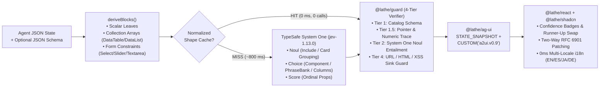

# Lathe — Non-Generative A2UI v0.9 Compiler & Runtime (`shadcn/ui` × `AG-UI` × `TypeSafe System One`)

> **Zero freeform LLM tokens. 100% calibrated closed-set selection (`Noul`, `Choice`, `Score`). Instant `0ms` shape-cached streaming and `0-call` multi-locale i18n.**

[](./SPEC.md)
[](./packages/ag-ui)
[](./packages/typesafe)
[](./packages/catalog-shadcn)
[](./LICENSE)

---

## Why Lathe?

Traditional "Generative UI" asks an autoregressive LLM to generate JSX, HTML, or large JSON component trees token-by-token. That introduces three systemic failures in production:
1. **Hallucinated Values & Policies**: The LLM invents numbers (`"$500 bonus"`), alters statuses, or hallucinates refund policies inside UI banners.
2. **Prompt-Injection XSS**: Untrusted data inside tool outputs tricks the LLM into emitting `<script>` or `javascript:` sinks inside props.
3. **High Latency & Cost**: Re-generating a 200-row table or switching UI locales (`en` $\rightarrow$ `ja`) takes seconds of LLM token streaming.

**Lathe replaces UI generation with UI compilation.**
Using **TypeSafe System One** (`jev-1.13.0`)—a fast, calibrated selection model supporting only `Noul` (binary entailment), `Choice` (closed-set classification), and `Score` (ordinal rating)—Lathe compiles any JSON state + optional JSON Schema into a verified **A2UI v0.9** surface rendered with **shadcn/ui**:

- **Every value** is bound via an **RFC 6901 JSON Pointer** (`{"path": "/order/duplicate_amount_usd"}`) directly to the verbatim data model.
- **Every component & prop** (`Stat`, `Badge`, `Progress`, `DataTable`, `DataList`, `Select`, `Slider`, `Textarea`, `Switch`, `Button`, `Alert`, `Card`) is chosen from a finite, statically linted catalog.
- **Every label** comes from an i18n `PhraseBank` (`EN` / `ES` / `JA` / `DE`), JSON Schema `title`, or deterministic pointer humanizer—allowing **instant `0ms` locale switching with zero model calls**.
- **Every repeated state shape** hits the array-normalized **AG-UI Shape Cache** (`computeShapeHash`) in **`0ms` with zero model calls**.

---

## Architecture



---

## Monorepo Packages

| Package | Description |
|---|---|
| [`@lathe/core`](./packages/core) | Compiler (`compileSurface`, `deriveBlocks`), RFC 6901 pointers, `PhraseBank` + `swapSurfaceLocale`, and static catalog criteria linter (`lintCatalog`). |
| [`@lathe/typesafe`](./packages/typesafe) | Official `@typesafe-ai/sdk` adapter (`TypeSafeAdapter`) pinned to `jev-1.13.0`. |
| [`@lathe/shadcn`](./packages/catalog-shadcn) | Flagship **14-component `shadcn/ui` catalog** (`Stack`, `Card`, `Stat`, `Progress`, `Badge`, `Alert`, `Input`, `Switch`, `Button`, `Select`, `Textarea`, `Slider`, `DataTable`, `DataList`) + 4-locale `SHADCN_PHRASE_BANK` (`en`, `es`, `ja`, `de`). |
| [`@lathe/guard`](./packages/guard) | 4-tier A2UI surface verifier (`tier1_schema`, `tier1_5_trace`, `tier2_entailment`, `tier4_sink`) with automatic sanitization. |
| [`@lathe/ag-ui`](./packages/ag-ui) | AG-UI protocol middleware (`LatheAgUiMiddleware`) and array-normalized shape-hash cache (`computeShapeHash`). |
| [`@lathe/react`](./packages/react) | `shadcn/ui` renderer (`renderSurfaceToHtml`) with confidence-driven degradation, runner-up swap chips, and two-way RFC 6901 patching (`applyPointerPatch`). |
| [`@lathe/cli`](./packages/cli) | Command-line interface (`lathe lint`, `lathe compile`, `lathe verify`, `lathe render --locale`). |
| [`@lathe/playground`](./apps/playground) | Interactive **Lathe Studio** web workbench (`http://127.0.0.1:4321`). |

---

## Quickstart

### 1. Install & Run Tests

```bash
pnpm install
pnpm test
```

### 2. CLI Usage (`@lathe/cli`)

```bash
# 1. Lint a component catalog for contrastive criteria quality
node packages/cli/src/bin.ts lint --catalog shadcn

# 2. Compile a state into an A2UI v0.9 surface (live with TYPESAFE_API_KEY or deterministic --replay)
export TYPESAFE_API_KEY="your_typesafe_key"
node packages/cli/src/bin.ts compile \
  --state state.json \
  --schema schema.json \
  --catalog shadcn \
  --locale es \
  --out surface.json

# 3. Run 4-tier @lathe/guard verification on any A2UI surface
node packages/cli/src/bin.ts verify --surface surface.json --catalog shadcn

# 4. Render to HTML in Japanese (ja) in 0ms with 0 model calls
node packages/cli/src/bin.ts render --surface surface.json --locale ja --out surface.html
```

### 3. Launch Interactive Lathe Studio

```bash
export TYPESAFE_API_KEY="your_typesafe_key"
node apps/playground/src/server.ts
# Open http://127.0.0.1:4321
```

---

## Live Benchmark Results (`TypeSafe System One jev-1.13.0`)

| Surface Feature | JSON Pointer | Input Type / Constraint | Selected Component | Confidence |
|---|---|---|---|---|
| Monetary KPI | `/order/duplicate_amount_usd` | `149` (`number`) | `Stat` (`format: "currency"`) | **`100.0%`** |
| Fulfillment Status | `/order/status` | `"duplicate_charge_confirmed"` | `Badge` (`variant: "destructive"`) | **`100.0%`** |
| Fraud Risk Score | `/order/risk_score` | `0.82` (`0..1` ratio) | `Progress` | **`100.0%`** |
| Homogeneous Array (`N` rows) | `/order/line_items` | `Array<{sku, qty, unit_price_usd}>` | `DataTable` (`currency` / `number` / `text` cols) | **`100.0%`** |
| Schema Enum Field | `/resolution/decision` | `enum: ["approve_full_refund", ...]` | `Select` | **`100.0%`** |
| Schema Range Field | `/resolution/refund_pct` | `minimum: 0, maximum: 100` | `Slider` | **`100.0%`** |
| Empty Multiline Field | `/resolution/memo` | `""` (`emptyField: true, multiline: true`) | `Textarea` | **`100.0%`** |
| Action Trigger | `/actions/approve_refund` | `"approve_refund"` | `Button` | **`100.0%`** |
| Repeat Compile (`Shape Cache`) | Any state with same schema | Normalized `SHA-256` shape hash | Cached `updateComponents` | **`0 ms` (`0` calls)** |
| Locale Switch (`EN`/`ES`/`JA`/`DE`) | `swapSurfaceLocale()` | `SHADCN_PHRASE_BANK` lookup | Instant prop translation | **`0 ms` (`0` calls)** |

---

## Specification & License

- Read the full formal specification in [**`SPEC.md`**](./SPEC.md).
- Licensed under [**Apache-2.0**](./LICENSE).
